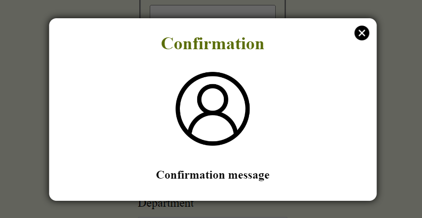

# modal-library

This is a customizable React modal

## Installation

To install, you can use [npm](https://npmjs.org/) or [yarn](https://yarnpkg.com):

    $ npm install modal-library-lfmi
    $ yarn add modal-library-lfmi

## Example

```jsx
import React, { useState } from 'react';
import ConfirmationModal from 'modal-library-lfmi';
import close from '../assets/img/close.png';
import user from '../assets/img/user.png';

function App() {
  const [modalState, setModalState] = useState(false);
  const handleOpen = () => {
    setModalState(true);
  };
  const handleClose = (e) => {
    e.preventDefault();
    setModalState(false);
  };
  const handleSubmit = (e) => {
    e.preventDefault();
    handleOpen();
  };

  return (
    <ConfirmationModal
      show={modalState}
      defaultStyle={true}
      closeModal={handleClose}
      iconClose={close}
      title='Confirmation'
      hideTitle={false}
      icon={user}
      hideIcon={false}
      text='Confirmation message'
      hideText={false}
    />
  );
}
```



## Props

| Name             | Type     | Description                    |
| ---------------- | -------- | ------------------------------ |
| **show**         | Boolean  | display modal or not           |
| **defaultStyle** | Boolean  | use the default styling or not |
| **closeModal**   | Function | handle modal closing           |
| **iconClose**    | String   | image for the close button     |
| **title**        | String   | define the modal title         |
| **hideTitle**    | Boolean  | display modal title or not     |
| **icon**         | String   | define the modal icon          |
| **hideIcon**     | Boolean  | display modal icon or not      |
| **text**         | String   | define the modal text          |
| **hideText**     | Boolean  | display modal text             |
